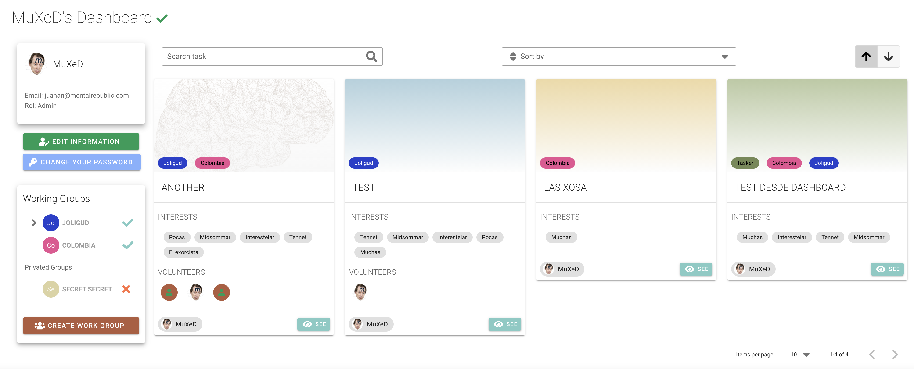
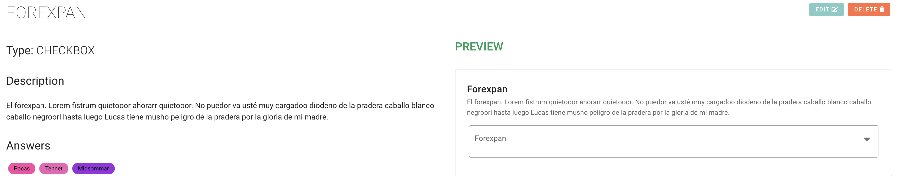
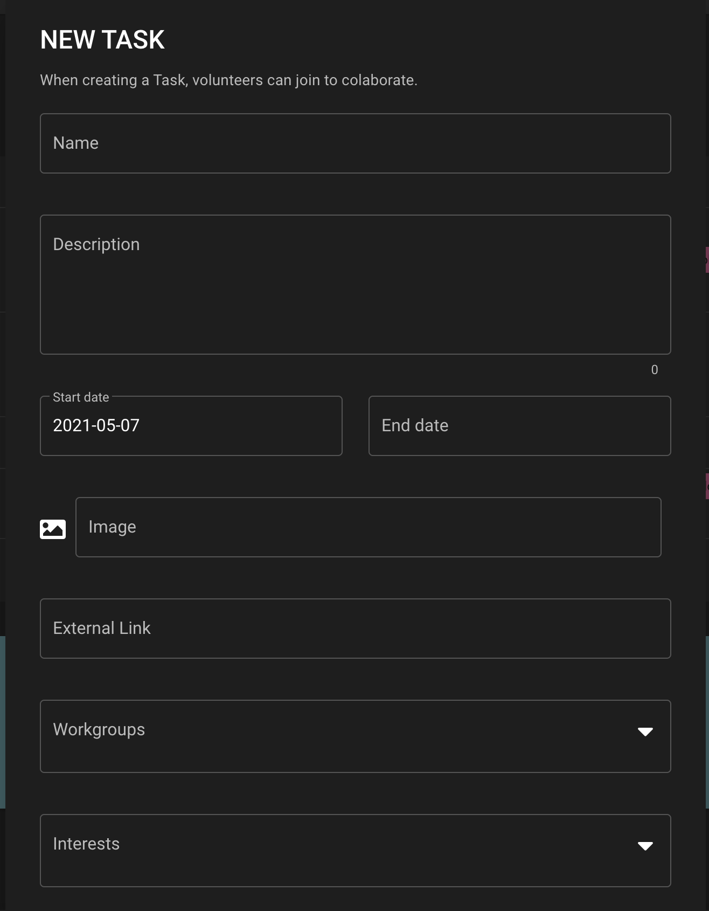
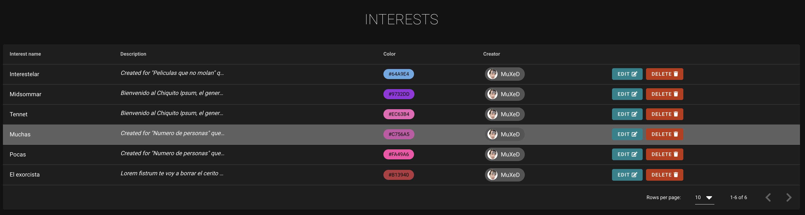
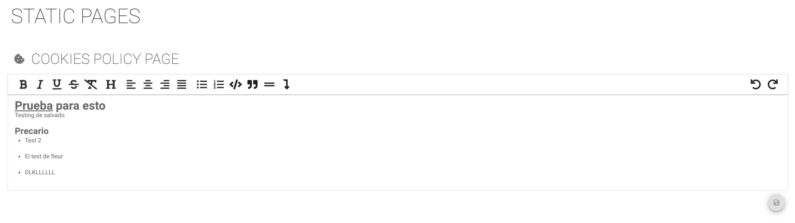
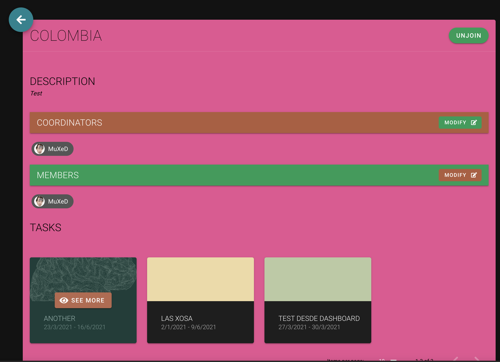
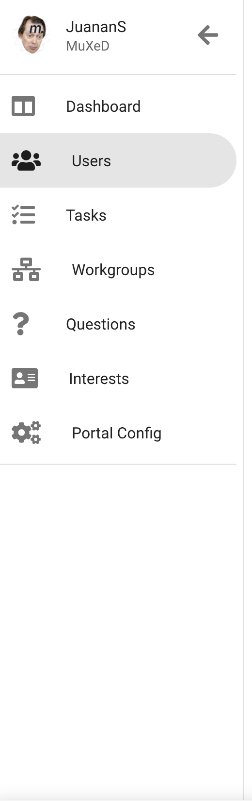
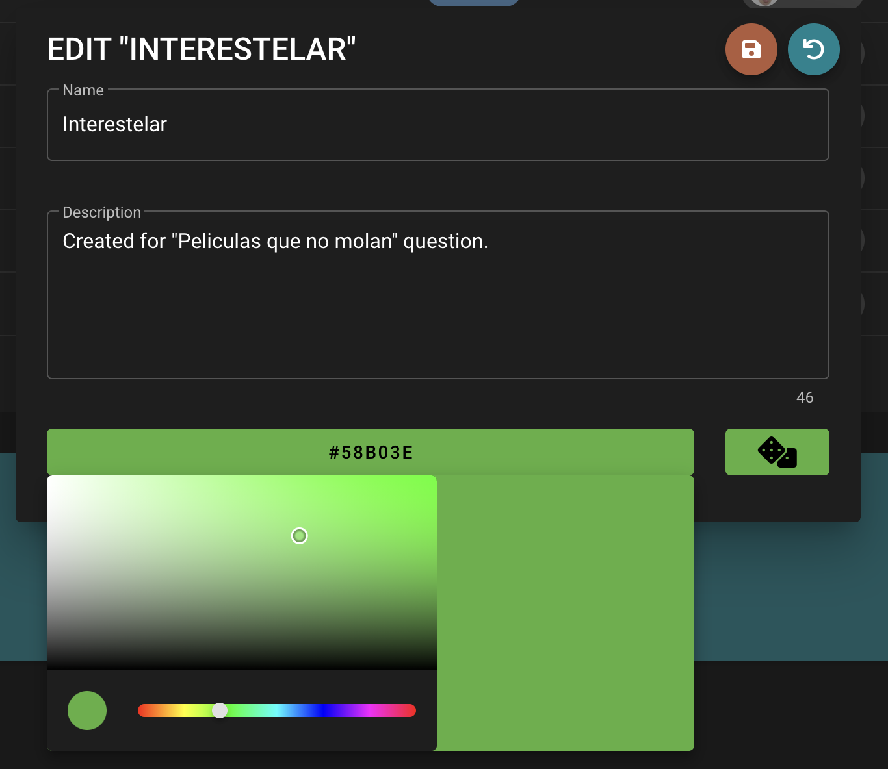

<div align="center">
  <a href="https://github.com/juananmuxed/teamcoo"></a>
  <br>
  <br>
  <p>
    <b>HR Platform for Non-profit associations</b>
  </p>
  <p>
    <sub>⌨️ with ❤︎ by
      <a href="https://github.com/juananmuxed">MuXeD</a>
    </sub>
  </p>
</div>

---

 [](LICENSE) [](https://discord.gg/88rzwfU) 

# What is TeamCoo
TeamCoo is a platform for non-profit Associations that need to manage large numbers of Volunteers. MEVN (Mongo, Express, Vue, Node) technology based.

Small associations need some way to unify all the Human Resources options when it comes to gathering Volunteers to do different tasks.

### 📌 Versions
Used [SemVer](http://semver.org/) for versions. For all available version, see [tags](https://github.com/juananmuxed/muxed/tags).

And here the [Changelog](CHANGELOG.md)

## 🍩 Screenshots










## 🏗 Built with
- [Vue](https://vuejs.org/)
- [Express](https://expressjs.com)
- [Node](https://nodejs.org/)
- [Mongo](https://www.mongodb.com)
- [Mongo-express](https://github.com/mongo-express/mongo-express)
- [Docker](https://www.docker.com/)

## Dependencies
- [Vuex](https://github.com/vuejs/vuex)
- [Vuetify](https://vuetifyjs.com/)
- [Bcryptjs](https://www.npmjs.com/package/bcryptjs)
- [DotEnv](https://www.npmjs.com/package/dotenv)
- [Ejs](https://www.npmjs.com/package/ejs)
- [JSON Web Token](https://www.npmjs.com/package/jsonwebtoken)
- [GridFS](https://www.npmjs.com/package/gridfs-stream)
- [NodeMailer](https://nodemailer.com)
- [Axios](https://github.com/axios/axios)
- [JS Cookie](https://www.npmjs.com/package/js-cookie)
- [Secure LS](https://www.npmjs.com/package/secure-ls)
- [Vue JWT Decode](https://www.npmjs.com/package/vue-jwt-decode)
- [Vuex PersistedState](https://www.npmjs.com/package/vuex-persistedstate)
- [TipTap](https://www.tiptap.dev/)

## 🎉 Features
- Create roles and admin Users
- Add Work Groups to group people and start to join this Work Groups
- Add Common or Specific question for Users to join Work Groups
- Add Tasks for the Work Groups to start to work in it and control members
- Add new Static Pages or configure the basics (CMS)
- Edit and delete all from the database

## 🥪 Installation
We pack all the application to run in a Docker server for easy Deploy.

### **Development**
To run in local:

Requirements:
- Node 12 at least
- MongoDB
- Nodemon in global `npm install nodemon -g`

Clone the repo
```bash
git clone https://github.com/juananmuxed/teamcoo.git
```

Access to the folder
```bash
cd teamcoo
```

Create (or modify) the .env to Enviorement Variables
```bash
WEB_NAME=name_ong
MONGO_ROOT_USER=rootname
MONGO_ROOT_PASSWORD=rootpass
MONGOEXPRESS_LOGIN=teamcoo
MONGOEXPRESS_PASSWORD=pass
SECRET_STRING=verysecret
API_VERSION=1
DATABASE_HOST=localhost
DATABASE_NAME=teamcoo
DATABASE_PORT=27017
API_PORT=3000
EMAIL_ACCOUNT=account@domain.es // Temporally here - Next update in Config
EMAIL_PASSWORD=smtp_password // Temporally here - Next update in Config
EMAIL_DOMAIN=mail.host.domain.es // Temporally here - Next update in Config
NODE_ENV=development
```

Then access to 2 folders (2 console prompt is easier)
```bash
CONSOLE 1: cd api
CONSOLE 2: cd client
```

Run the scripts
```bash
CONSOLE 1: npm run dev
CONSOLE 2: npm run serve
```

And you can access to the application via web browswer in http://localhost:8080

### **Production**
Easy, you need Docker in the Deploy server or machine

Requirements:
- Docker

Clone the repo
```bash
git clone https://github.com/juananmuxed/teamcoo.git
```

Access to the folder
```bash
cd teamcoo
```

Create (or modify example.env) the .env to Enviorement Variables
```bash
WEB_NAME=name_ong
MONGO_ROOT_USER=rootname
MONGO_ROOT_PASSWORD=rootpass
MONGOEXPRESS_LOGIN=teamcoo
MONGOEXPRESS_PASSWORD=pass
SECRET_STRING=verysecret
API_VERSION=1
DATABASE_HOST=localhost
DATABASE_NAME=teamcoo
DATABASE_PORT=27017
API_PORT=3000
EMAIL_ACCOUNT=account@domain.es // Temporally here - Next update in Config
EMAIL_PASSWORD=smtp_password // Temporally here - Next update in Config
EMAIL_DOMAIN=mail.host.domain.es // Temporally here - Next update in Config
NODE_ENV=development
```

Build the Dockers with docker-compose
```bash
docker-compose build
```

And up the Network
```bash
docker-compose up -d
```

The ports are the next by default:
- API: 3000
- APP: 8080
- DB-Admin: 8081
- Database: 27017

## 🥘 Wiki
🚧 Under construction

# 💖 Associations in this project
## Catapa
  <a href="https://github.com/juananmuxed/teamcoo"></a>

[](https://catapa.be)

[](https://catapistas.catapa.be)

[](https://opencollective.com/)

## ❓ Want this App
If you are an Association and want something like this. Contact via email, or any other method with me.

# 🍰 Contributing

Please read [CONTRIBUTING](CONTRIBUTING.md) for details on our [CODE OF CONDUCT](CODE_OF_CONDUCT.md), and the process for submitting pull requests.

## ☕️ Buy Me a Coffee
[](https://ko-fi.com/U7U21M2BE)

## 📑 License

MIT © [MuXeD](LICENSE.md)